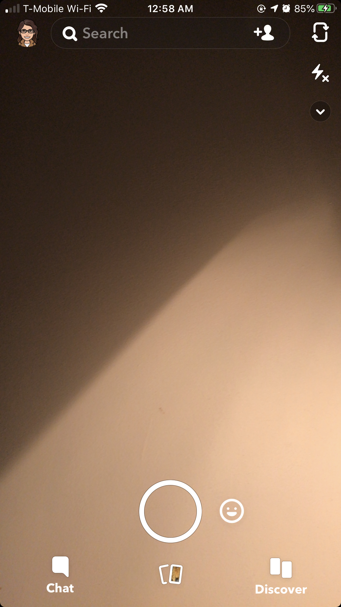

# A Heuristic Evaluation of Instagram and Snapchat

### DGT 150 Assignment 1 by Kimberly Jimenez

###### The reason I choose Instagram and Snpachat, to heuristically evaluate, is because I spend a lot of my recreational time on both of these apps which double as online communities. Online communities, as a whole, connect users together from around the world, including long and short distances. Whereas Snapchat is meant for a more private form of communication, both Snapchat and Instagram create friendships and relationships through mutual interests. 
---
 ### Information About Instagram
 

 
 Visit your [Instagram](https://www.instagram.com)!
 
Instagram is a social media site used for photo and video sharing and networking with other users. Captions tend to accompany photo and video posts, but users have the choice to the use the option to their discretion, whether brief, long, or blank. Instagram is known for connecting celebrities to their fans, connecting friends and family, used to engage with and share artwork, travels, concerts, and other similar experiences. Furthermore, the app can be used to connect with people in real-time (Instagram Live) or a brief 24 hour recap (Instagram Story).

A first glance view at Instagram proves the app has the basic funcitionalities of a working app. There are five icons at the bottom of the app which allows users to navigate the app. Posting several photos and videos without having to clutter a profile allows for an aesthetically pleasing feed and profile. Aside from the Heart and Paper Airplane icon, the Home, Search, Add, and Profile icons are easy to understand and hints to where the icon may lead a user. However, the Heart icon leads to Acivity, which is not immediately understood by simply looking at the icon. Moreover, the Paper Airplane icon leads to direct messages between users, the two have no immediate correlation. The app no longer informs users how many likes a post has received, which can experience, enjoyment, and validation. The app makes it diffucult for a user to access the posts they have liked. Links that are unnecessarily repetitive—"Close Friends"—could make space for useful features, such as "Posts You've Liked". These are only some of the user issues immediately found. To summarize, the app is functional, but needs work.

---
### Information About Snapchat

Visit your [Snapchat](https://www.snapchat.com)!

Snapchat is a multimedia messaging app, used to communicate with friends and family. Messages, Snaps, and Stories are meant to last no longer than 24 hours. Users can communicate one-on-one or in group chats. It is a fast and easy way to communicate daily and current updates of an individual's life and experiences, without the permeance of other social media or messaging sites. It allows users to connect with celebrities, who can choose to post updates of their daily life. Users can suscribe to different types of channels, whether they be informational or for entertainment. Also, Snapchat allows users to track their friends through the Map, which gives them location whereabouts. 

A first glance view at Snapchat proves the app, like Instagram, equips the basic functionalities of a working app. There are four landing pages in total—Snapchat Messages, Camera, Stories and Subscriptions, and Shows. The layout is simple and easy to navigate with the swipe of a finger. However, there are issues that need to be dealt within the landing pages and the experience of the app itself. On Snapchat Messages, there is no way to erase old chats, which is inconvenient for users who no longer message each other. On Camera, simply touching the screen activates Snapchat's filters, even though there is already an icon for them to appear. Shows is a repetitive landing page and mimics the "For You" under Stories and Subscriptions. These are only some of the user issues immediately found. To summarize, the app is functional, but needs work.

---
### Visibility of System Status

##### Instagram:

Instagram does not inform users or track how many Likes a post has received—whether that be their post or from someone they follow. If users want to know how many Likes a post has received, they have to manually count them, which can become absurd with posts that receive millions of Likes. This is a recent update; it has negatively impacted users who use Instagram for advertising and sponsorships. Furthermore, it affects users on a personal level, who receive validation from the people liking their posts. Instagram has stated they want their users to focus on sharing, rather than Likes; however, they still inform users how many Comments a post has received, which is a contradiction to their refusal to provides users with statitcal information about Likes. (3)

Users are unable to rewind, forward, pause, or play videos. Videos play automatically and continue until they are finished only for them to loop again. Instagram provides a brief time marker in the beginning of the video to indicate how long it is, but it disappears soon after (approximately 3 seconds in) and the user is left to wonder how much time there is left. (3)

##### Snapchat:

Subscriptions on Snapchat, when viewing and swiping through the Story of that particular channel, have no indicator to let users know how far along they are into the Story or even how long the Story is to begin with. Netflix has an indicator on "Continue Watching" which I think could be useful for Subscriptions, Stories, Channels, etc. (1)

---
### Match Between System and the Real World

##### Instagram:
